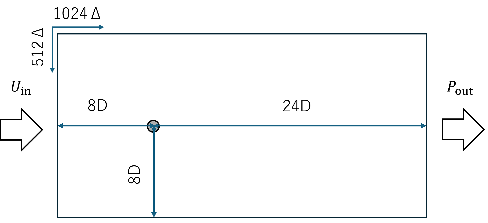

# Test case -2D cylinder-

## porosity settings



- filename: porosity_cylinder.csv
- dimension: 1024 $\Delta$ $\times$ 512 $\Delta$
- thickness: 1.5
- radius: 16 $\Delta$

Boundary conditions: Periodic boundary conditions on the top and bottom, uniform flow (left), pressure fixed (right).

## Running Simulation

To ensure that the application is set up correctly, you can run a provided test case located in the `test/` folder. Follow these steps:

1. Open a terminal and navigate to the application directory:

    ```bash
    cd PixelFlow
    ```

2. The source code is built from the following script.

    ```bash
    sh project.sh -b
    ```

3. Unzip the cylinder-2d.zip file located in the test folder and move it to cylinder-2d/.:

    ```bash
    unzip test/cylinder-2d.zip
    cd cylinder-2d
    ```

4. Run the simulation script:

   ```bash
   sh run.sh
   ```

   You will be prompted to select an executable file, so please choose either ibm2_drag_omp or ibm2_uniform_omp. Then enter the number of OpenMP parallel threads.

   ```text
   Available executable files:
   0: ibm2_drag_omp
   1: ibm2_uniform_omp
   2: ibm3_air_condition_omp
   3: ibm3_uniform_omp
   Enter the number of the executable file to run: 1
   Enter the number of threads to use for execution:3
   Running ibm2_omp...
   ```

   The processes are output to runlog_*.txt files inside the logs folder.
   Additionally, execution information is output to process.txt inside the logs folder.

5. Monitor the progress in the `logs/` directory and check for successful execution in the `{output_folder}/` directory.
6. Upon successful completion of the 2D test case, your directory structure should resemble the following:

   ```plaintext
   .
   ├── config
   │   └── controlDict.txt
   ├── cylinder
   │   └── output_paraview.vtk
   ├── data
   │   └── porosity_cylinder.csv
   ├── doc
   │   ├── fig
   │   │   └── test-cylinder.png
   │   └── info.md
   ├── etc
   │   ├── divergent.dat
   │   ├── grid.dat
   │   ├── solution_uvp.dat
   │   └── surface_profile.dat
   ├── logs
   │   ├── process.txt
   │   └── runlog_2024.02.25-23.46.31.txt
   ├── quit.sh
   └── run.sh
   ```

7. To confirm the successful execution of the 2D test case, follow these steps:

   1. Locate the `output_paraview.vtk` file in the `cylinder` directory.

   2. Open the file using visualization software such as Paraview.

      - If you can visualize the results in Paraview without any issues, it indicates the completion of the test case execution.

    Congratulations, you have completed your 2D test case. If you encounter any problems or have further questions, please refer to the documentation provided or submit to [Github issues](https://github.com/nobu-n2002/PixelFlow/issues).

   Thank you for your efforts!
